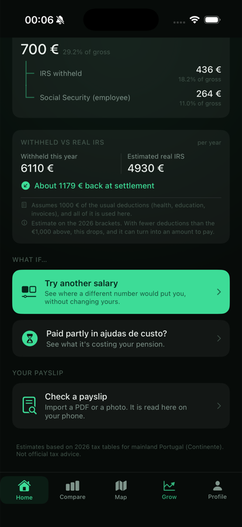
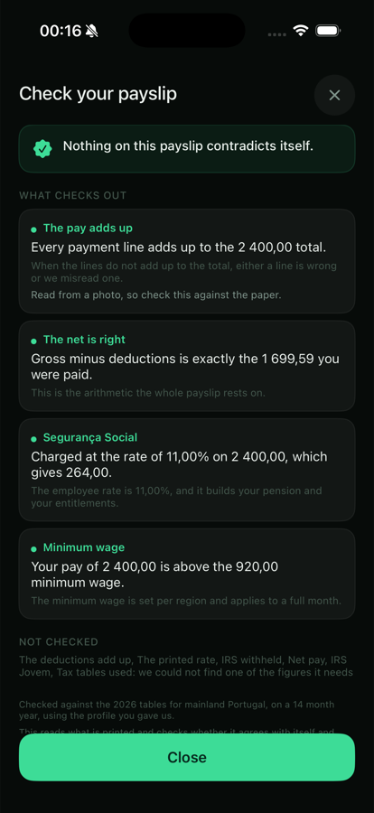
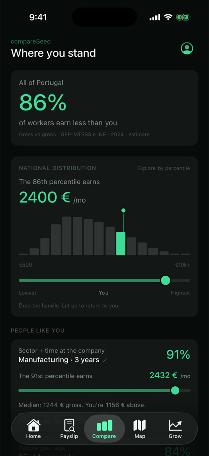
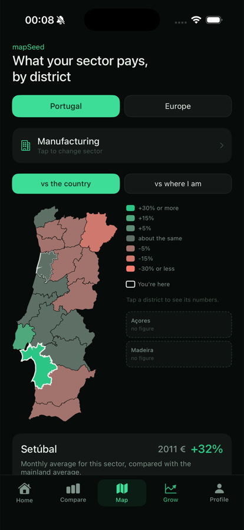

# SalarySeed

An iOS app that tells you what a salary in Portugal actually means. What lands in your
account, what it costs your employer, where it sits against everyone else, what it might
be in twenty years, and how it compares across the European Union. It will also read your
payslip and tell you whether the arithmetic holds.

Every figure comes from a published, openly licensed table. Nothing you type ever leaves
the phone, because there is no networking code in the app outside StoreKit.

**[Watch the demo](https://afonsoaz.github.io/SalarySeed)**

<p align="center">
  
  
  
  
</p>

SwiftUI, iOS 17, no dependencies and no backend. 70 Swift files, and the tax and payslip
engines are about a third of them. Built for the App Store, not yet submitted.

If you only have a minute, the three parts worth reading about are:

- **[One country, three tax tables](#one-country-three-tax-tables).** Why the obvious
  shortcut is wrong, by 0.0001.
- **[Labels propose, arithmetic disposes](#labels-propose-arithmetic-disposes).** Reading
  a payslip when you can trust neither the OCR nor the words on it.
- **[Testing a judgement](#testing-a-judgement).** Why half of this app got a verifier and
  the other half got a diff tool instead.

## What it does

| Tab | What it answers |
|---|---|
| **Home** | What you earn now. Gross and net either way round, yearly figures, total cost to your employer, the full breakdown, and the annual IRS settlement with every assumption written out. |
| **Payslip** | Whether your last payslip adds up. Give it a PDF or a photograph and it checks ten things, on the device, and says which ones it could not check and why. Free, and the most interesting part of the app. |
| **Compare** | How that sits against other people, now. National percentile plus cohort comparisons by sector, tenure, age, education and region. |
| **Map** | Where it would sit differently. A Portuguese district choropleth, free, and a 27-tile grid of the European Union, for supporters. |
| **Grow** | What it might become. Your pay projected over 5, 10 or 20 years, staying put against changing employer. For supporters. |

The sixth thing is not a tab. **Profile** holds the inputs behind all of it, each with what
it unlocks, and the one place the app asks for money. It is reached from the top of Home,
because a native iPhone tab bar shows five items and the checker earned one of them.

## One country, three tax tables

Portugal withholds income tax through three regional tables, and the tempting assumption
is that the islands are a discount on the mainland. Açores really is 0.70 of Continente,
on eleven of its twelve rates, to the last published digit. On the twelfth the official
workbook rounds the other way: 0.70 x 0.3969 is 0.27783 and the workbook prints 0.2779.
The code follows the workbook, because the workbook is the law and the multiplication is
only the reason behind it.

Madeira is not a multiple of anything, and that is not a contradiction. A withholding
table is built around a regional minimum wage, so a different floor gives a different
derivation of the same underlying rates. The married single-earner table has 12 rows in
Continente, 11 in Madeira and 10 in Açores. They are three objects, not one object with a
coefficient.

Two consequences worth pointing at in the code:

- **`region` has no default value at any entry point.** Not `.continente`, not anything.
  An absent region is a silent wrong answer that would follow an islander across every
  screen forever, so the compiler is made to ask the question at every call site.
- **Net back to gross is 60 rounds of bisection, not algebra.** There is no closed form
  once the exemption and the settlement are in it. The bisection calls the same forward
  function the app displays, so the two directions cannot quietly disagree.

[`SalarySeed/Engine/TaxEngine.swift`](SalarySeed/Engine/TaxEngine.swift)

## Labels propose, arithmetic disposes

A Portuguese payslip has no standard layout and no standard vocabulary. One calls a line
"Segurança Social (11%)" and the next calls it "Seg. social empregado". If the reader is
looking at a photograph then the labels are the part recognition gets right and the
numbers are the part it gets wrong. And there is no answer key: nobody publishes what your
payslip should have said.

So the reader normalises the PDF text layer and the Vision output into one coordinate
space, does the row and column geometry itself, and then works out what each line is using
three arithmetic identities that need no words at all:

- **Net.** Some earnings total minus some deductions total equals some net. That single
  triple names three figures at once and reveals which column is which.
- **Eleven percent.** Employee Social Security is 11% of a base, checked in hundredths of
  a cent, which finds both the contribution and the base whatever the line is called.
- **Contiguous runs.** The lines immediately above a printed total add up to it. When they
  do not, the gap is the size of the error and the run is where to look.

Be precise about the order, because it is the feature and it is easy to overstate. Labels
are read first, and the lexicon is what picks which lines belong to which side. What the
arithmetic has is the veto. A run that misses its printed total is reported as a gap
rather than quietly accepted. Three earlier comments in this codebase claimed the reader
never read a label at all, which was flattering and untrue, and they were corrected.

The safety net earns itself constantly. On a photographed payslip Vision misread one
deduction by thirty cents, and the deductions run came up thirty cents short of its own
printed total. Caught, without anything needing to know which line was the misread one.
The iOS 26 document and table recognition API was tried first and rejected: on the same
page it corrupted a figure by four cents and invented a value next to a correct one, and
on a second payslip it found no tables at all.

The best thing this feature taught me came from two bugs that were cancelling. A column
test was mislabelling every deduction as an earning on the layout that stacks the two
blocks vertically, and a label fallback was silently undoing it. The reading on screen was
correct and neither half of it was, so fixing either one alone would have been a
regression. You cannot find that by reading the code, and you cannot find it with a test
that only asks whether the final answer is right.

Three rules keep the feature honest, and they are why it is allowed to exist:

- **A check that cannot run says so, with the real reason.** On the payslips it was built
  against, four or five of the ten checks do not run, because the tax engine models a
  month as gross times a schedule and real payslips are not always shaped like that. The
  screen names each one and why. Collapsing "these two figures differ" and "we never found
  one of them" into a single boolean once made the app accuse a payslip of withholding on
  the wrong base when it had simply failed to read the base. Three states need three
  states.
- **A figure we had to guess at cannot accuse anybody.** Anything resting on a
  low-confidence reading can reach "worth knowing" and never "wrong".
- **A total has to be a total of something.** A payslip carries several figures that
  satisfy earnings minus deductions equals net, including the year-to-date block. One that
  its own lines do not add up to is not believed. That rule has already retracted a real
  reading rather than let the app accuse somebody's employer of underpaying them.

Nothing about the payslip is stored. The file is read into memory, checked, and discarded
when the screen closes, and leaving mid-read cancels the recognition rather than letting it
finish over a screen that has gone. One figure can outlive it, and only one: from v1.2 the
screen ends by asking whether the monthly gross it read should become your salary, and a yes
keeps that number and nothing else. Not the document, not the lines, not the employer or the
name on the page, and not the fact that a payslip was ever opened.

## Testing a judgement

There is no test target in this project, and
[`tools/verify_tax_engine.py`](tools/verify_tax_engine.py) is what stands in for one on
the part where being wrong matters most. It parses the withholding tables straight out of
`TaxEngine.swift` rather than keeping a copy of them, so it checks the code that ships and
cannot drift away from it. It round-trips both island tables against the official .xlsx
workbooks they were generated from, every bracket and rate and parcela, with a zip and XML
reader written by hand so the script has no dependencies. It replays the workbooks' own
published effective-rate column back through the engine's formula at 63 independent
points, which tests the arithmetic and not just the transcription. And it checks the four
things no source document can tell you: that net never falls as gross rises, that each
region's minimum wage withholds nothing, that the annual médias agree with their normal
rates, and that net to gross inverts.

Continente is the gap, and it is declared as one. Its table comes from a Despacho with no
workbook behind it, so it is covered by the invariants and by nothing else.

The payslip layer got something different, and the reason is the part worth keeping. A
script can check code that restates a table, because the table has a source to compare it
against. Code that makes a judgement about a page cannot be checked by restating the
judgement in Python, because a second opinion is not a check. So
[`tools/payslip_probe`](tools/payslip_probe) compiles the shipping `Engine/` sources,
unmodified, into a command line tool and prints what they decide about a real file: every
line with the concept, provenance and confidence it was given, then the facts, then the
verdict. It is a diff tool rather than a pass or fail, because there is no answer key for
a payslip and the useful thing is seeing what moved after a change. It found six bugs the
script could not have.

```bash
python3 tools/verify_tax_engine.py        # must pass before any release
python3 tools/verify_payslip_reader.py    # must pass before any release
tools/payslip_probe/build.sh              # then: .build/payslip_probe <file.pdf|.png>
```

A fresh clone cannot run all of it. The source workbooks are not in the repo, so the
verifier skips its round trip and says so, and the probe needs a payslip you supply
yourself. More on what each check is for in [`docs/verification.md`](docs/verification.md).

## Rules the code follows

These are not aspirations. Each one is enforced somewhere, and most were learned the hard
way.

- **Say what the data cannot do, on the screen.** Thin cells carry a caveat. Sector is not
  job title. The district table has no tenure dimension, so it can shift a path and cannot
  bend it.
- **State every assumption, unconditionally.** If the app assumes the €1,000 credit or an
  IRS Jovem exemption, it says so in every branch, including the ones where the assumption
  turns out not to apply.
- **Never draw a shape the data does not have.** Six published tenure bands means a
  staircase, not a smooth curve, and the ten sectors whose pay falls between some bands
  are drawn falling.
- **Never mix survey levels, only ratios cross.** GEP and Eurostat measure different
  populations in different years, so a Portuguese salary is never placed beside a Eurostat
  mean. The European uplift is computed entirely inside Eurostat and then applied to your
  own salary.
- **Quote rates, not bare percentages.** A percentage with no time attached cannot be
  compared to a raise or to inflation. Anything labelled "per year" is the compounded rate
  of the path actually drawn.
- **Recording is not exploring.** Changing your stored salary and trying a hypothetical
  are separate acts with separate UI. Grow's whole scenario lives in memory and never
  reaches `UserDefaults`.
- **Ask for money once, where they came looking.** The support sheet opens from a button
  in the profile and from nowhere else. No countdown, no crossed-out price, no
  interstitial, no nagging on the tenth launch. An app whose whole argument is that it does
  not manipulate the reader cannot manipulate the reader at the till.
- **The receipt is the truth, never the cache.** `UserDefaults` mirrors the entitlement
  only so the first frame does not flicker. `Transaction.currentEntitlements` overwrites it
  on every launch and `Transaction.updates` overwrites it on every refund, so a paid flag
  can never outlive the payment.

## How it is put together

```
SalarySeed/
  Engine/      pure computation, no SwiftUI
    TaxEngine            2026 IRS + Social Security, gross/net, annual settlement
    PercentileEngine     two-piece log-normal national distribution
    SalaryDataset        every published Portuguese figure, with provenance
    CohortEngine         percentile within a cohort
    DistrictDataset      sector x district means and counts
    DistrictShapes       CAOP outlines, projected and simplified
    DistrictComparison   the Portuguese map's readings and colour buckets
    EuroDataset          Eurostat SES: 17 NACE sections x 27 countries + price levels
    EuroComparison       the European map's ratios, ranks and colour buckets
    GrowthEngine         the projection: anchoring, stay and move paths, rates
    PayslipText          homoglyph, separator and label normalisation
    PayslipNumber        per-token money parsing, integer cents, never Double
    PayslipLayout        fragments to rows and money columns, geometry only
    PayslipLexicon       what a line is, by expanded token set rather than substring
    PayslipDocument      a reading, and the gate that says this is not a payslip
    PayslipClassifier    the three numeric identities: net, 11%, column sums
    PayslipFacts         what was read and how sure we are of each figure
    PayslipReconciler    facts against TaxEngine, into findings
    PayslipFinding       the findings model and the one function that tiers them
  Features/    one folder per screen
    Shared/SupportLock     the real screen, blurred, where Grow and the Europe map live
    Payslip/               the checker: PDF and Vision extraction, then the flow
  Models/      SalaryStore (the single source of truth), Localization, catalogues
  Theme.swift  design tokens, the OKLCH diverging ramp, and .appFont, which is
               how every point size in the app becomes the reader's point size
  PrivacyInfo.xcprivacy  the privacy manifest, checked against the build on every build
```

The engines never import SwiftUI and never read the store. Views never do arithmetic.
Everything the user sees in words comes from `Models/Localization.swift`, in English and
European Portuguese.

## The data

Everything is published, openly licensed, and bundled. Nothing is scraped, and no
crowdsourced or recruiter figure is embedded anywhere.

- **GEP-MTSSS, Quadros de Pessoal, October 2024** (CC BY 4.0). A near-census of
  private-sector employees. Quadro 104 for sector by tenure at the employer, Quadros 110
  and 61 for sector by district with worker counts, Quadros 105/114/138 for education,
  region and age.
- **INE, Inquérito à Estrutura dos Ganhos 2022** (CC BY 4.0), for the shape of the
  national distribution.
- **Eurostat, Structure of Earnings Survey 2022** (`earn_ses22_24`, free reuse with
  attribution), for the European comparison.
- **CAOP / DGT** for the district boundaries, credited in-app.
- **Tax**: a real 2026 engine for all three fiscal regions, each with its own withholding
  tables and its own annual rates. Social Security 11% and 23.75%, the withholding tables
  from Despacho 233-A/2026, the nine annual escalões, the specific deduction, dependant
  credits, the €1,000 general-expense credit, and IRS Jovem in both the monthly
  withholding and the annual settlement.

The datasets keep their own licences wherever they go and are not covered by this
repository's [LICENSE](LICENSE).

## Where the data goes

Nowhere.

The app has no server, no account and no analytics. `grep -r URLSession SalarySeed`
returns nothing: there is no code path that could send your salary anywhere, which is a
stronger statement than a privacy policy and the reason the App Store label reads "Data
Not Collected" without qualification.

The one exception is not about you. StoreKit talks to Apple to fetch the product price and
complete the €4.99 purchase. Apple is the seller of record, so the app never sees an Apple
ID, a name or a payment detail.

A contribution pool was also built, and deliberately not shipped. It worked: rows reached
Firestore through a Cloud Function, documents were named by keyed hash so the token was
never stored, erasure deleted and could not be used as an oracle, and the security rules
denied every client path. It is not here because collecting pay data turns a one-person
app into something with real compliance obligations, and that was out of proportion to
what the pool would have been worth in its first year. The payment is unaffected either
way. Full detail in [`PRIVACY.md`](PRIVACY.md).

## What it does not do

Estimates for guidance, not tax advice. The engine models regular monthly salary under
2026 rules for whichever of the three fiscal regions you are in, and does not know your
health or education deductions. Cohort figures cover private-sector employees; public
function contracts sit outside the Quadros de Pessoal entirely, and the app says so once
you tell it that is your situation. Within-cohort dispersions are modelling assumptions,
not published values, while the national curve's are derived from published deciles. The
European figures are 2022 against Portugal's 2024, which is exactly why the two are never
added together.

Two things are missing and worth naming before you find them:

- **The tax engine hardcodes 2026.** `TaxEngine.taxYear` is a real constant and Home names
  the year and the region it computed with, so a reader in 2027 is at least told which
  tables produced the number. The engine itself still has no concept of a year: nothing
  compares `taxYear` to the calendar, so in January 2027 every figure quietly becomes last
  year's, with no error and no crash. That is the worst failure shape left in the app.
- **VoiceOver.** Dynamic Type was finished in v1.0.3 and this is a different axis. Every
  chart and the Portugal map are still invisible to a screen reader. The payslip flow is
  labelled, which is one screen done and not the pass.

Also missing: island cohort figures, because the Quadros de Pessoal cover Continente only
and the app says so wherever that bites. Tenure on the European map. A real pension model.
Self-employed mode. Variable pay in the tax engine.

## Build it

Open `SalarySeed.xcodeproj` in Xcode 16 or newer, pick a simulator, and run. iOS 17
minimum. There are no dependencies to fetch, no account to sign in to and no backend to
start.

The shared scheme points at `SalarySeed.storekit`, so the purchase, the restore and even a
refund all work in the simulator with no App Store Connect product and no paid developer
account.

```bash
xcodebuild -scheme SalarySeed -destination 'platform=iOS Simulator,name=iPhone 17' build
```

`SalarySeed/` is a folder-synchronized group, so every `.swift` inside it is compiled
whether or not git knows about it. [`docs/verification.md`](docs/verification.md) explains
why that matters.

## Licence

All rights reserved. The source is published to be read, not reused. See
[LICENSE](LICENSE), and note that the bundled datasets keep their own terms.

Version history, including the bugs that shipped and what they cost, is in
[CHANGELOG.md](CHANGELOG.md).

Afonso Azevedo, 2026.
